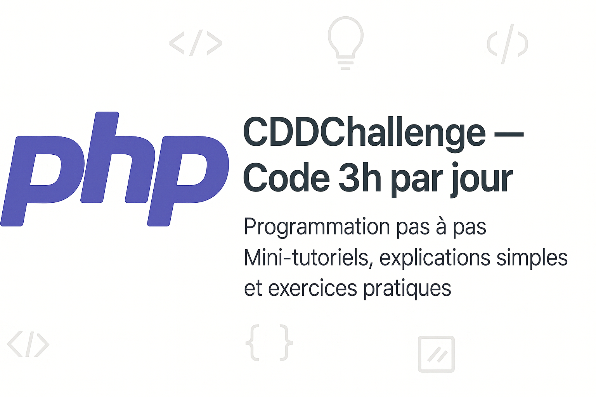

# CDDChallenge - Code 3h par jour
Programmation en PHP pas à pas

Bienvenue sur mon dépôt GitHub où je documente mon apprentissage de PHP, pas à pas, à travers des mini-tutoriels pratiques, simples, pensés pour les débutants pour évoluer progressivement.
> L'idée est d'apprendre PHP en construisant et en partageant des petits bouts de code utiles, sans jargon inutile ni complexité prématurée.
> Rendre la programmation accessible aux vrais débutants, avec des mini-tutos simples, clairs, et sans bla-bla.

**Défi personnel : consacrer 3h par jour au code, pendant 30*3 jours.**  

---

## 🎯 Objectifs spécifiques : passer le **CAP**

- C_oder pas à pas, avec rigueur et curiosité
- A_pprendre PHP en profondeur
- P_artager tes réussites, mais aussi les bugs

Je vais documenter chaque étape de mon apprentissage, construire des mini-projets concrets (outils, exercices, petites applis), et montrer qu’avec la régularité (même seulement 3h/jour), tout devient possible. 

---

Mon projet principal :
[👉 cdd-challenge](https://github.com/sonziat/cdd-challenge)

Ce que tu trouveras :
- Des mini-exercices PHP pratiques
- Des explications pour ceux qui commencent de zéro
- Des idées de projets faciles à coder

---

## Tutoriels disponibles

Chaque dossier contient :
- Du **code prêt à exécuter**
- Des **explications claires**
- Un **exercice** ou une mini-démo

| # | Sujet                              | Lien                       |
|---|------------------------------------|----------------------------|
| 1 | Variables                          | [`01-variables`](jours1-10/tutoriels/01-variables) |
| 2 | Conditions `if / else`             | [`02-conditions`](/jours1-10/tutoriels/02-conditions) |
| 3 | Boucles `for - while -etc.`             | [`03-boucles`](/jours1-10/tutoriels/03-boucles) |
| 4 | Tableaux `array()`        | [`04-tableau`](/jours1-10/tutoriels/04-tableaux) |
| 3 | Formulaire + `$_POST`              | [`05-formulaire-post`](/jours1-10/tutoriels/05-formulaires-post) |

> D’autres tutoriels arrivent chaque semaine !

---

## Prérequis

Pour tester les fichiers `.php`, tu peux utiliser :
- Un serveur local comme **[XAMPP](https://www.apachefriends.org/fr/index.html)** ou **[MAMP](https://www.mamp.info/)**
- Intaller ton environnement, j'en parle ici : [Environnement de travail](https://github.com/sonziat/cdd-challenge/environnement)
---

## Pourquoi ce dépôt ?

Je suis passionnée par la programmation PHP et j’ai décidé de documenter mon apprentissage publiquement pour :
- Garder une trace de mes progrès
- Aider d’autres débutants à ne pas se décourager
- Créer une base simple pour apprendre PHP pas à pas

> Ce dépôt est un **journal de progression** + une **boîte à outils** pour ceux qui commencent.

---

## Me suivre / contribuer

Tu peux :
- **Mettre une étoile** à ce repo pour suivre ma progression
- **Contribuer** avec une correction, un exemple ou une amélioration
- **Me suggérer** un sujet de tutoriel (issues ouvertes !)

Me suivre ici :
- LinkedIn : [Sonzia Teutsong Marie-Audrey](https://linkedin.com/in/sonzia-teutsong)
- LinkedIn Challenge : [CDDChallenge](https://www.linkedin.com/feed/update/urn:li:activity:7379463413032329216/)
- GitHub : [sonziat](https://github.com/sonziat)

---

## Licence

[CC-by-nc-sa](LICENSE) – Utilise ce contenu librement, mentionne la source si tu le partages.

Obligations légales : https://creativecommons.org/licenses/by-nc-sa/4.0/deed.fr

---

> Merci d’être là. Bon apprentissage à toi aussi !
